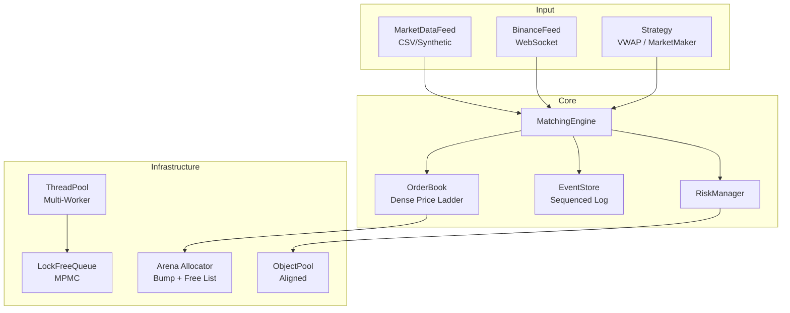
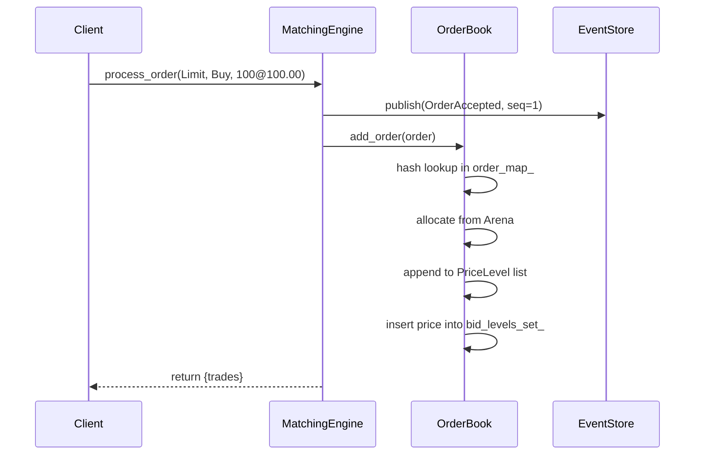
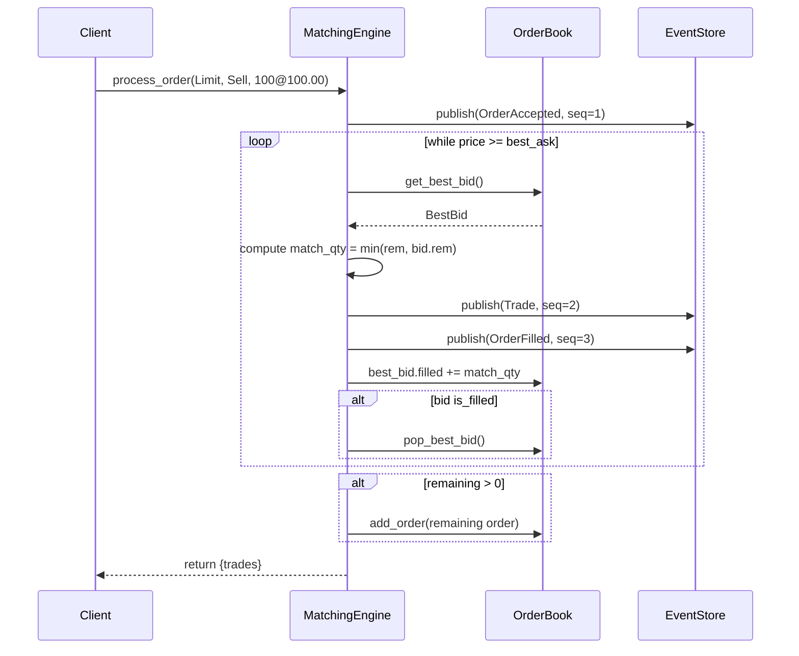
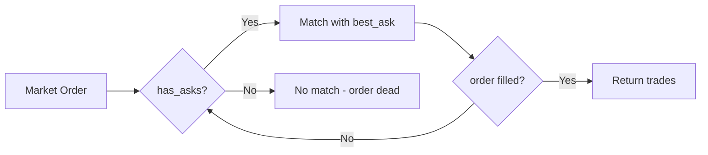
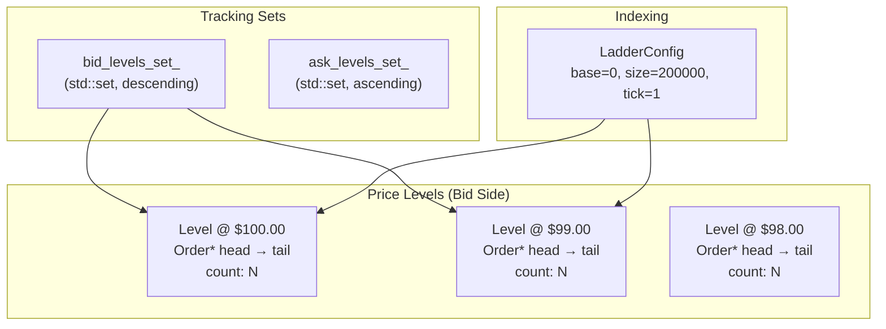
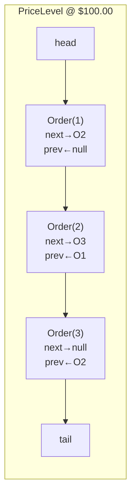

# HFT Trading System — Architecture

A low-latency C++20 matching engine and exchange simulator designed for algorithmic trading interviews and performance-critical applications.

## System Architecture



**Key design principles:**
1. **Zero-copy matching** — Intrusive linked lists avoid allocations on hot path
2. **Deterministic replay** — Every event carries a monotonic sequence number
3. **No heap fragmentation** — Arena allocator pre-allocates contiguous memory
4. **Cache-line conscious** — 64-byte aligned hot structs, hot/cold field splitting

---

## Order Flow

### Limit Order (no match)



### Limit Order (with match)



### Market Order



### Iceberg Order

```mermaid
flowchart LR
    A[Iceberg Order] --> B[Visible Qty = min(visible, total)]
    B --> C[Match visible qty]
    C --> D{Visible fully<br/>consumed?}
    D -->|Yes| E[Replenish visible<br/>from hidden reserve]
    E --> C
    D -->|No| F[Remaining visible<br/>sits on book]
```

---

## Matching Engine Internals

### Dense Price Ladder



The price ladder is a `std::vector<PriceLevel>` indexed by `idx = (price - base) / tick`. O(1) access to any price level. Two separate arrays for bids and asks — no buy/sell interference at the same price.

### Intrusive Linked List (per price level)



**O(1) insert/remove** — orders carry their own `next`/`prev` pointers. No memory allocation during insert. Removal is pointer reassignment followed by free list return to the Arena.

### Price-Time Priority

Orders at the same price level are ordered by arrival (FIFO within the intrusive list). When matching, we always match against `head` (oldest order at that level). When adding, we append to `tail`.

### Best Bid/Ask Tracking

`std::set<int64_t>` tracks non-empty levels:
- **bid_levels_set_**: descending order (`rbegin()` = best bid)
- **ask_levels_set_**: ascending order (`begin()` = best ask)

O(log N) for the best-level lookup, but N is the number of non-empty levels (typically << total levels).

---

## EventStore (Publisher)

```mermaid
graph TB
    subgraph "EventStore"
        EVENTS[("std::vector&lt;Variant&gt;<br/>Trade | ExchangeEvent")]
        SEQ[Atomic Sequence Counter]
        SUB[Subscribers<br/>TradeCallback + EventCallback]
    end

    subgraph "Publish Flow"
        O[Order] --> ME[MatchingEngine]
        ME --> EV1["publish(Trade)"]
        ME --> EV2["publish(ExchangeEvent)"]
        EV1 --> SEQ[assign seq=N]
        EV2 --> SEQ[assign seq=N+1]
        SEQ --> VEC[push_back to vector]
        VEC --> CALL[invoke callbacks]
    end

    subgraph "Replay"
        R[Replay Request<br/>seq_start → seq_end]
        R --> VEC2[vector random access]
        VEC2 --> HAND[handler(Event)]
    end
```

**Key properties:**
- **Sequenced**: Every event has a globally unique, monotonic sequence number
- **Dual event types**: `Trade` for fills, `ExchangeEvent` for lifecycle (Accepted, Cancelled, Filled, Modified, Rejected, StopTriggered)
- **Zero-copy callbacks**: Subscribers receive `const&` to the stored event
- **O(1) random access replay**: `replay(from, to, handler)` uses vector subscript
- **Thread-safe**: Atomic sequence counter, subscribers are std::function (copyable)

### Event Types

| EventType | Description |
|-----------|-------------|
| `OrderAccepted` | Order entered the book |
| `OrderCancelled` | Order removed by user |
| `OrderFilled` | Order partially or fully matched |
| `OrderModified` | Quantity amended |
| `OrderRejected` | Order rejected (PostOnly, FOK, risk check) |
| `StopTriggered` | Stop-loss/stop-limit activated at market price |
| `Trade` | Fill event with price, quantity, maker/taker IDs |

---

## ThreadPool

```mermaid
graph TB
    subgraph "ThreadPool"
        MUT[Mutex]
        CV[Condition Variable]
        Q[Task Queue<br/>std::queue&lt;function&gt;]
        RUNNING[Atomic bool]
        ACTIVE[Active Tasks Counter]
    end

    subgraph "Workers (4 threads)"
        W1[Worker 1]
        W2[Worker 2]
        W3[Worker 3]
        W4[Worker 4]
    end

    subgraph "Enqueue"
        E[enqueue(task)] --> MUT
        MUT --> Q[push task]
        Q --> CV[notify_one]
    end

    W1 --> CV
    W2 --> CV
    W3 --> CV
    W4 --> CV
    CV --> |wake| W1
    CV --> |wake| W2

    W1 --> Q
    Q --> W1[pop, active_tasks++]
    W1 --> EXEC[execute task]
    EXEC --> ACTIVE[active_tasks--]
    ACTIVE --> CV[notify_all]
```

**Synchronization:**
- `queue_mutex_` protects both the task queue and `active_tasks_` count
- `wait_all()` waits until `tasks_.empty() && active_tasks_ == 0`
- Exception-safe: `task()` wrapped in try-catch to prevent worker thread death
- `packaged_task` + `std::future` for return value propagation

---

## Arena Allocator

```mermaid
graph TB
    subgraph "Arena"
        BUF[Buffer<br/>aligned_alloc(64, 4MB)]
        BUMP[Bump Offset<br/>bump_offset_]
        FREE[Free List<br/>free_head_]
    end

    subgraph "Allocation Path"
        A1[allocate()] --> F{free_head_ != null?}
        F -->|Yes| F1[pop from free list]
        F -->|No| B{bump_offset_ + sizeof &lt;= capacity?}
        B -->|Yes| B1[return &buffer[bump_offset_]]
        B1 --> B2[bump_offset_ += sizeof(Order)]
        B -->|No| NULL[return nullptr]
    end

    subgraph "Deallocation"
        D[deallocate(order)] --> D1[order→next = free_head_]
        D1 --> D2[free_head_ = order]
    end
```

**Why an arena?**
- Zero heap fragmentation: all orders are in one contiguous block
- O(1) allocate/deallocate (bump pointer or free list head)
- Excellent cache locality for intra-price-level traversal
- `aligned_alloc(alignof(Order), ...)` ensures 64-byte alignment

---

## CPU Optimizations

### Cache Line Layout (Order struct — 128 bytes)

```
┌───────────────────────────────────────┐
│  Cache Line 0 (64 bytes) — HOT        │
│  order_id price quantity filled       │
│  next prev (pointers)                 │
├───────────────────────────────────────┤
│  Cache Line 1 (64 bytes) — COLD       │
│  client_id timestamp side type        │
│  status tif stop_price visible...     │
└───────────────────────────────────────┘
```

**Hot path** (first cache line): fields accessed on every match operation — IDs, price, quantity, linked-list pointers.

**Cold path** (second cache line): fields only needed for reporting, risk checks, or special order types.

### Prefetching

`__builtin_prefetch(cur->next, 0, 1)` is issued before consuming the current order in matching loops. When the current order is filled and removed, the next order's cache line is already in L1.

### Branch Hints

- `[[likely]]` on: matching loop entry, order found in cancel/amend, filled check
- `[[unlikely]]` on: null pointer deref checks, special order types (iceberg, stop, post-only), OCO link cancellation

---

## Performance Targets

| Operation | Current Latency | Target |
|-----------|----------------|--------|
| OrderBook find (50K levels) | 28 ns | < 50 ns |
| MatchingEngine single limit | 116 ns (P50) | < 200 ns |
| MatchingEngine single limit | 2.6 μs (P99) | < 5 μs |
| LockFreeQueue enq+deq | 49 ns | < 100 ns |
| RiskManager check_order | 28 ns | < 100 ns |
| EventStore replay | 28 ns/event | < 50 ns |
| Full backtest throughput | 2.6M ops/sec | > 1M ops/sec |

---

## File Layout

```
include/hft/
├── order.hpp            # Order, Trade, MarketTick, LadderConfig
├── arena.hpp            # Bump + free-list arena allocator
├── order_book.hpp       # Dense ladder + intrusive lists + best-bid/ask
├── matching_engine.hpp  # Price-time priority matcher + event publishing
├── publisher.hpp        # EventStore — sequenced log + replay
├── market_data_feed.hpp # CSV/synthetic market data loader
├── binance_feed.hpp     # Binance WebSocket (libcurl + TLS + JSON)
├── strategy.hpp         # Strategy base + VWAP, MarketMaker
├── backtester.hpp       # Simulation orchestrator
├── metrics.hpp          # Latency/throughput instrumentation
├── benchmark.hpp        # Custom microbenchmark framework
├── lock_free_queue.hpp  # MPMC lock-free queue
├── thread_safe_matching_engine.hpp  # Thread-safe wrapper
├── thread_pool.hpp      # Multi-worker thread pool
├── object_pool.hpp      # Object pool with alignment support
└── risk_manager.hpp     # Risk-constrained matching wrapper
```

---

## Interview Tips

1. **Why dense ladder over tree?** — O(1) price level access vs O(log N) for a tree-based book. The trade-off is fixed price range (configurable via LadderConfig). For crypto/equity markets with known tick sizes, this is the standard approach.

2. **Why intrusive lists?** — Zero allocations on the matching hot path. Orders carry their own linkage, so removing from the middle of a price level is O(1). Non-intrusive containers (e.g., `std::list`) would allocate nodes separately.

3. **Why EventStore?** — Audit trail, backtesting replay, market reconstruction. Every event is sequenced so you can reconstruct any point in time. O(1) random access enables fast range queries.

4. **Why separate bid/ask ladders?** — A bid at $100 and an ask at $100 live in different vectors, so modifying one doesn't evict the other's cache line.

5. **Sequence numbers on all events** — Foundation for exactly-once delivery, gap detection, and LOB snapshot reconstruction.
